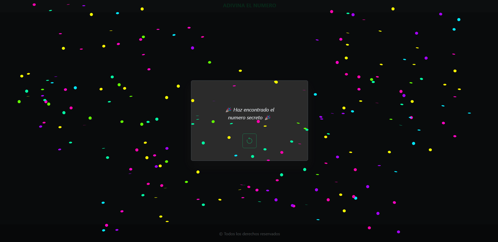

<p align='center'>
  <a href="https://adivinaelnumerojs.netlify.app/">
    
  </a>
</p>
<div align='center'>
  <a href="https://developer.mozilla.org/es/docs/Web/HTML">
    
  </a>
  <a href="https://developer.mozilla.org/es/docs/Web/CSS">
    
  </a>
  <a href="https://developer.mozilla.org/es/">
    
  </a>
  <a href="https://getbootstrap.com/">
    
  </a>
</div>

<div align='center'>

## Descripción 📃
Este repositorio es un ejercicio de JavaScript, enfocado en la manipulación del DOM (Document Object Model). 
Esto tiene como finalidad mejorar mis habilidades en la interacción y modificación de elementos en la página web y en el navegador.

Estoy utilizando este espacio para aprender y practicar diferentes técnicas y métodos que nos ofrece JavaScript para interactuar con el contenido y la estructura de las páginas web, así como con el entorno del navegador.

## DEMO 🌍

Mira una demostración del proyecto [aqui](https://adivinaelnumerojs.netlify.app/)

</div>

<div align="center">

## Consigna 

`
Crea una web con bootstrap y js, que contenga un botón comenzar el juego, en ese momento se crea un número aleatorio que el usuario deberá adivinar, la interfaz del usuario debe tener además un input para ingresar un número y un botón enviar, al presionar el botón enviar mostrar en un alert si el usuario adivino o no el número mágico, si no lo adivino indicarle con un alert si el número que ingreso es mayor o menor al número mágico.
Cuando el usuario adivine el número mostrar un mensaje indicando al usuario que adivino el número.
`
</div>

<div align="center">

## Instalación

Clona este repositorio en tu máquina local usando `git`:
</div>

```bash
$ git clone https://github.com/WalterGonzalez33/adivinaElNumero.git
$ cd adivinaElNumero
```
<div align="center">

## Desarrollador 💻

<div>
  <a href="https://github.com/WalterGonzalez33">
    
  </a>
</div>

 [Walter Gonzalez](https://github.com/WalterGonzalez33) 
</div>

<div align="center">
    <p>¡Gracias por visitar y usar este repositorio! 🎉</p>
</div>
